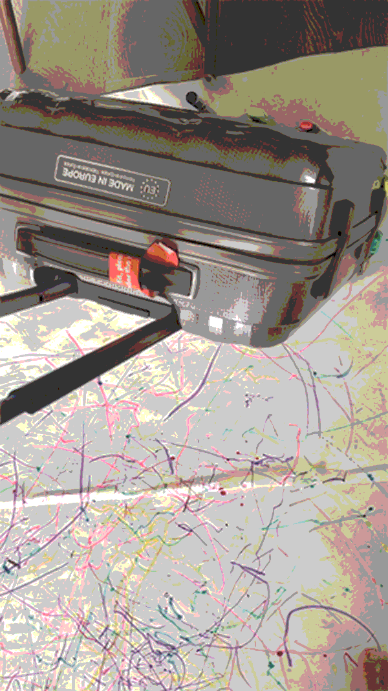

# Week3 Non-Human Machines??? WHAT?

## Class Activity

I like to create stupid crazy things ( or I often call as "little inventions ") , especially when I have to have to finish it in a short amount of time, my competitive self somehow starts to kick in, my excitement rises up and I am so ready to make a mess. 

When I knew that we had about an hour to make an non-human machine, I was so excited. I looked around my table and there were just coloured pens and papers that I prepared before the class. Nothing seemed to work. I kept running around my tiny apartment to look for movable or wheely or rotatble objects but there's nothing in my apartment! Then remembered my trusty-little-4-wheel-carry-on luggage that was hidden underneath my bed. Next to it, there was a long roll of paper so I could cut and tape them into a big canvas too. I also pushed my sofa and my carpet out of the way and vacuum all the dust underneath to make room for "the machine". 

Everything I did next was trying to wrap my coloured highlighters and pens around the luggage and then rolled it back and forth to take video and photos.

I managed to make another machine using my sticky roller too, buy it didn't work

 

VOILÀ! I did all of the above in just in time to show to the class. What's a lucky day!

 

 

 

 

Oh, I forgot to sketch my machine out but oh well... hehe

## Speculative Design
I learned new word today, Speculative Design = it could work
Andy also mentioned a method called MoSCoW = Must Have, Should Have, Could Have and Won't Have which I found very useful.
He encouraged us to comeup with lots of different ideas, try them out ,and trust my instincs

I think now I know what I am looking for in the "Project Pitch"
